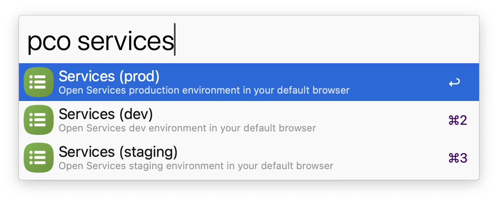

# Planning Center Development Environments

For Planning Center engineers. Open Planning Center products in local, staging, and production environments using `pco`.

[Download the Alfred extension](https://github.com/starzonmyarmz/pco-app-env-alfred/releases) and double-click to install.

---

## About development

Vibe coded using [Claude Code](https://docs.anthropic.com/en/docs/claude-code/overview). The initial release took roughly $7 worth of tokens over 2 hours of interfacing with Claude.
